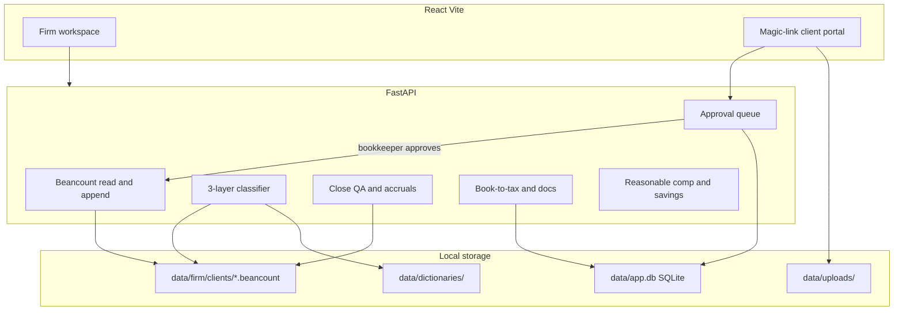

# StatsLedger AI (FastAPI + React)

## Stack choice

**FastAPI + React (Vite + Tailwind + Lucide)**, not Streamlit.

The superprompt asks for a production-grade, branded SaaS with a distinct bookkeeper workspace and a passwordless client portal. React + Tailwind can hit the navy/mint 60-30-10 system, monospace ledger amounts, and split layouts. Beancount parsing, balancing, classification, accruals, and Excel exports stay in Python where they belong.

Gemini/BigQuery chat is **out of scope** (no GCP data source; classification is heuristic, OCR is simulated as the spec requires).

## Storage split: ledger vs app state

Two stores, both local files, with a hard rule about which owns what.

- **Ledger (`.beancount` text)** owns anything an accountant would defend in an audit: accounts, postings, amounts, tags, journal entries.
- **App state (`data/app.db`, SQLite)** owns everything operational: magic-link tokens, review inbox, staged client edits, receipt metadata, document checklists, classification feedback.

SQLite is still a single file on the machine, so the subscription-free philosophy holds, but we avoid hand-rolling locking and migrations for five kinds of JSON.

### Beancount is read/validate via library, write via our own text emitter

Correction to the earlier draft: the `beancount` printer is **not** a round-trip formatter. It guarantees output that re-parses to the same data structure, but it drops comments and original layout and normalizes syntax (total-cost `@@` becomes per-unit prices). See [beancount#586](https://github.com/beancount/beancount/issues/586), where the maintainer's recommended workaround is manipulating raw input text.

Therefore:

- Read and validate with `loader.load_file` — trust it for balance checks and errors.
- **Never** regenerate a whole file from parsed entries; hand-authored comments would vanish.
- Write by appending formatted text to the client's journal, guarded by a `filelock` so an approval and a client submission cannot interleave.
- Corrections/reclasses append as new dated entries rather than editing prior lines, which also gives a natural audit trail.

## Architecture

Note the portal has no edge to the ledger. Client input reaches `.beancount` only after a bookkeeper approves it.

One process in production-style demo: FastAPI serves `/api/*` and the Vite `dist/` build. In development: uvicorn on `:8000` + Vite on `:5173` with a proxy.

## Directory structure

- [`backend/app/main.py`](backend/app/main.py) — FastAPI app, CORS, static SPA fallback
- [`backend/app/ledger/`](backend/app/ledger/) — beancount reader (library) + append-only writer (ours), trial balance, CSV/XLSX export, tags (`class`, `location`)
- [`backend/app/db/`](backend/app/db/) — SQLite schema and accessors for app state
- [`backend/app/classify/`](backend/app/classify/) — three-layer cake + explainable confidence
- [`backend/app/close/`](backend/app/close/) — payee grouping, anomalies, accruals
- [`backend/app/portal/`](backend/app/portal/) — token issue/verify, staged client edits, receipt intake
- [`backend/app/tax/`](backend/app/tax/) — prior-year ingest, doc sorter, book-to-tax, lead sheet
- [`backend/app/tax/constants_2025.py`](backend/app/tax/constants_2025.py) — single dated source for every tax figure
- [`backend/app/advisory/`](backend/app/advisory/) — reasonable comp + tax savings
- [`backend/app/money.py`](backend/app/money.py) — `Decimal` helpers, rounding, allocation-with-remainder
- [`backend/app/seed.py`](backend/app/seed.py) — generate 2–3 clients and sample txs
- [`frontend/src/`](frontend/src/) — layout, firm routes, `/portal/:token`
- [`data/firm/clients/`](data/firm/clients/) — live `.beancount` files (accounting source of truth)
- [`data/app.db`](data/app.db) — SQLite operational state (gitignored)

Keep the original [`automated-bookkeeping-superprompt.md`](automated-bookkeeping-superprompt.md).

## Cross-cutting rules

- **Money is `Decimal`, never `float`** — parse with `beancount.core.number.D`, and route all rounding through `money.py`. A test asserts no float ever reaches a posting.
- **Allocation absorbs remainder in the final period** so a 12-month split of $1,000.00 sums to exactly $1,000.00.
- **Clients carry an `entity_type`** (`sole_prop`, `s_corp`, `partnership`). It selects the book-to-tax map (Schedule C vs 1120-S vs 1065) and gates Module 6 — reasonable comp only applies to S-corps.
- **Every tax figure lives in one dated constants module** (QBI thresholds, SE tax rates, Section 179 cap, M&E limit, standard mileage). Advisory output is labeled "estimates for planning, not tax advice."

## Design system

Follow the superprompt brand, using data-app layout patterns (KPI row, sticky tables, selection side panel):

- Dark default: `#0F172A` / `#1E293B` backgrounds, `#F8FAFC` cards in light workspace mode
- Accent mint `#10B981` for balanced/matched; amber `#F59E0B` for &lt;85% confidence
- **Inter** for UI, **JetBrains Mono** for amounts
- Sun/Moon toggle; Lucide icons; `date-fns` dates as `MMM dd, yyyy`

## Delivery phases

Build a working vertical slice before going wide, so there is something real to click after Phase 1 instead of six half-modules.

- **Phase 1 (gate):** scaffold + ledger + classifier + review inbox. Demoable end-to-end: import a bank CSV for a seeded client, watch the three layers code it with visible reasoning, accept, see it appended to the `.beancount` file and reflected in the trial balance.
- **Phase 2:** close/QA and the magic-link portal — the two modules that write back through approval.
- **Phase 3:** tax prep and advisory — mostly read-side computation and reporting on top of a ledger that already works.

## Module implementation (all six, no stubs)

### 1. Flat-file double-entry ledger — Phase 1

Read/validate with the `beancount` library; append with our own text emitter under a file lock (see storage split above). Emitted entries carry metadata for class/location so one workspace holds lemonade stands, rental properties, and G-Wagons.

Every post must balance; reject unbalanced writes before touching the file. APIs: list accounts, **add account** (append an `open` directive — needed the moment a classifier correction targets a category that doesn't exist yet), list transactions (filter by period/class/location), post journal entry, trial balance, export CSV/XLSX. Seed one rich client plus a second so Layer 2 has firm history.

**Broken-ledger recovery is a first-class state, not a 500.** The design invites hand-editing `.beancount` files, and every module reads them — one bad edit must not brick the client. When `loader.load_file` returns errors, the API responds with a structured error payload (file, line, message) and the workspace renders a persistent banner with the bean-check output; write endpoints refuse to append until the file loads clean.

### 2. Three-layer autoclassification — Phase 1

Cascade with a 0–100 confidence score; **&lt;85% → Uncategorized / review inbox**, threshold configurable per client.

1. **Client model** — fuzzy match payee + narration + amount band against that client's posted history
2. **Firm model** — same merchant across other clients in `data/firm/clients/`
3. **Global model** — keyword/merchant dictionary → standard COA (QBO-style: Advertising, Meals, Office, COGS, Auto, etc.)

**Confidence must be explainable, not a magic number.** Each layer returns a score derived from stated signals — exact merchant match with unanimous history scores in the high 90s, fuzzy match scales with similarity ratio, dictionary fallback caps in the 60s, and any contradiction in prior codings pushes the score down. The API returns the reason alongside the score, and the UI renders it: "Layer 2 — four prior Amazon transactions across the firm, all coded Office Supplies." This explanation is the differentiator of a three-layer cake and is what makes the review inbox trustworthy.

API: classify an imported bank file (or pasted rows), preview suggested postings, accept (append to beancount) or send to inbox.

**Ingest via `beangulp`, supporting OFX/QFX and CSV.** This is beancount's native import framework (the successor to `beancount.ingest`), so we get declarative column mapping from `beangulp.importers.csvbase` instead of hand-rolling parsers, and OFX/QFX covers most banks and credit cards without per-institution work. No aggregator, no credentials, no vendor cost.

Structure the reader behind a small `BankSource` interface returning a normalized row, with `CsvOfxSource` as the only implementation for now. A future Plaid/Teller/SimpleFIN connector then becomes one new implementation rather than a rewrite of the import path — see "Deferred: live bank connections" below.

**Duplicate detection on import.** Re-importing the same CSV (or overlapping date ranges) must not double-post to an append-only ledger. Fingerprint each row as (date, amount, normalized payee) against already-posted transactions and prior imports; matches are flagged "possible duplicate" in the preview, excluded from bulk-accept by default, and individually overridable.

**Correct-before-accept in the review inbox.** The most common bookkeeper action is "the suggestion is wrong": the inbox row lets them pick a different account (or add a new one via the ledger add-account API), then post. Every correction is recorded in the classification-feedback table so Layers 1–2 see it as history on the next run — the correction, not the original suggestion, is what the models learn from.

### 3. Auto-close and QA — Phase 2

- Payee grouping view with mixed-account flags
- Anomaly engine: negative cash, same payee → multiple expense accounts in period, txs &gt;$1,000 missing memo/receipt, postings to parent (not leaf) accounts
- **Flag as Needs Info**: every anomaly row has a one-click action that creates a Needs Info request (SQLite table: transaction ref, question, status). These requests join Module 2's uncategorized rows as the portal's work queue — this is the explicit Module 3 → Module 4 handoff the spec requires ("flagged by Module 2 and 3")
- **Period lock date**: closing a month sets a per-client `close_date` in SQLite. The append writer rejects any entry dated on/before it (client approvals and reclasses included); corrections to a closed period must be dated in the open period. A close checklist view shows the anomaly checks passing before offering the "close month" action — without this, "auto-close" is just a report
- Accruals: regex on `for the period DATE to DATE` plus a manual tag → monthly prepaid/accrual schedule, allocated in `Decimal` with the remainder landing in the final month so the schedule ties exactly to the invoice. Consistent with the approval-gate philosophy, the schedule is a **preview** — monthly JEs append to the ledger only when the bookkeeper approves the schedule (future months post as their date arrives or on demand, never silently)

### 4. Uncat magic-link portal — Phase 2

Bookkeeper issues a token; the client gets `/portal/:token` with no username or password. Security posture, even for a prototype:

- Store only a **hash** of the token in SQLite, with an expiry, a single-client scope, and a `revoked_at` column; rate-limit verification attempts. The bookkeeper's token list shows active links with a **revoke** button for the forwarded-link / wrong-email case — expiry alone isn't enough
- The portal endpoint returns only that client's work queue — Module 2's uncategorized rows plus Module 3's Needs Info requests — never the full ledger
- Client submissions land in a **staged edits table**; nothing from a public URL touches a `.beancount` file until a bookkeeper approves
- Uploads: validate magic bytes rather than trusting `Content-Type`, cap size, store under a generated name, and never build a filesystem path from the user-supplied filename

Client can memo, pick a simplified category, and upload PDF/PNG. **Simulated vision** extracts merchant/date/amount from a receipt-fixture map (and optional naive PDF text) and proposes a match; the parsed filename is treated as untrusted input used only for matching, never for pathing. On approval, the entry appends to the ledger with the stored receipt path attached.

### 5. Tax prep — Phase 3

- Ingest prior-year JSON (plus optional PDF text scrape); generate questionnaire + document checklist (W-2, 1099-NEC/INT, etc.)
- Bulk upload zone: **simulated** form-type detection from filename/text → check off checklist
- Book-to-tax grid driven by the client's `entity_type`: Schedule C lines for sole props, 1120-S for S-corps, 1065 for partnerships, with the **50% M&amp;E limitation** applied in the calculation
- Workpaper: openpyxl "Tax Prep Lead Sheet" workbook in a **tax-software import layout** (per the spec: "formatted for direct import into Lacerte/UltraTax/Drake"): one row per tax line with columns for tax line code, description, book amount, M-1/book-to-tax adjustment, tax amount, and source-document link — not a generic transaction dump. A second sheet holds the detail behind each line

### 6. Advisory — Phase 3

- Reasonable-comp wizard, **enabled only for `s_corp` clients**: net income, hours, industry table → documented salary + range (comparable wage × FTE, clamped vs profit)
- Visual savings: Augusta Rule, S-corp salary vs SE tax, QBI 20%, Section 179 — two ECharts views: (1) "current vs optimized" liability for the active year, and (2) the spec's **cumulative year-over-year savings** chart — a stacked area/bar of savings per strategy accumulated across years, fed by seeded prior-year figures. All figures sourced from the dated constants module and labeled as planning estimates

## Seed data (so the UI is immediately alive)

- Client **Harbor Lemon Co.** (`sole_prop`): mixed class/location tags, bank feed mix, some uncategorized Amazon/Stripe, one prepaid "for the period", one &gt;$1,000 missing receipt, one parent-account posting
- Client **Northside Rentals** (`s_corp`): overlapping vendors for firm-model matches, and the entity type that unlocks reasonable comp
- Global merchant dictionary + industry wage table + per-entity book-to-tax map JSON
- Two to three seeded **prior tax years** of summary figures per client (net income, liability, strategies applied), so the cumulative YoY savings chart and prior-year ingest render with real-looking history
- Hand-written comments in the seeded `.beancount` files, so the append-only writer is provably not clobbering them

## How to run

- `backend`: `uvicorn app.main:app --reload`
- `frontend`: `npm run dev`
- README with one-command `./scripts/dev.sh` (or npm + python concurrently)

## Verification

- `pytest`: balance invariant, no-float-in-postings, classifier layer order and score reasoning, import dedup (re-importing the same CSV posts nothing new), lock-date enforcement (writer rejects entries dated in a closed period), accrual split summing exactly, 50% M&E, reasonable-comp math, token expiry/scope/revocation rejection, upload magic-byte rejection, malformed-ledger returns structured errors and blocks writes
- Golden-file test on emitted beancount text, plus `bean-check` over the seeded ledgers
- Round-trip test: append entries, reload, confirm hand-written comments survive
- Browser pass of the firm workspace and the portal before calling it done

## Out of scope (prototype)

Real bank OAuth, real LLM/OCR APIs, QuickBooks sync, multi-user auth for the firm (single local firm workspace), production secrets, hosted deploy. Everything stays in local files: beancount for the ledger, SQLite for app state.

## Deferred: live bank connections

Not being built now — statement import via `beangulp` is the Phase 1 path. Captured here so the `BankSource` seam is designed correctly and this stays a one-file addition later.

- **Poll, never webhook.** A local-first app has no public callback URL. Plaid's `/transactions/sync` is cursor-based and idempotent, so a scheduled job or a "Sync now" button reaches the same state a webhook would have pushed. Persist the cursor per connection.
- **Cost model is per-connection, not per-call.** Plaid bills Transactions monthly per Item while the access token exists, even with zero API calls, so revoke-on-offboard is a required feature rather than cleanup. Plaid's free Trial plan (10 Production Items, real data) covers evaluation. Teller's developer tier includes 100 free live US connections; SimpleFIN Bridge is $15/yr, read-only, client-owned, refreshing daily — adequate for bookkeeping and the closest fit to the credential-free philosophy.
- **Book only posted transactions.** Pending transactions are reissued with a new ID once they post (linked by `pending_transaction_id`); booking them double-books the ledger days later.
- **Idempotency and reversals.** Store the provider transaction ID as beancount metadata, dedupe against it, and honor the `removed` list returned by sync.
- **Emit `balance` directives** from provider-reported balances. This is beancount's native mechanism for catching a missed or duplicated transaction, turning reconciliation into something `bean-check` verifies at close.
- **Tokens are bearer credentials to client financial data.** They must not sit plaintext in `data/app.db`; encrypt at rest with a key from the OS keychain and log every sync and revocation. Holding live multi-client access is a materially different risk profile than the flat-file prototype and would warrant its own review before shipping.
